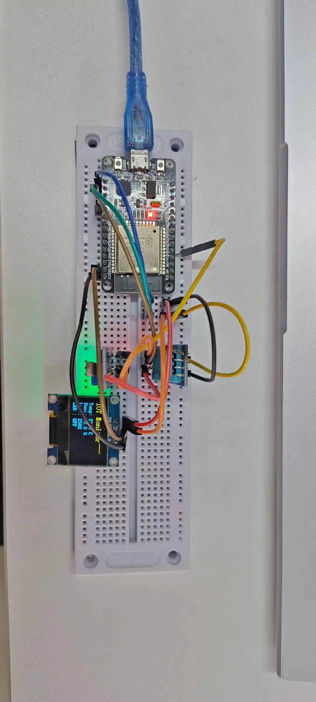

# IoT Protocol Project

基于 ESP32 的物联网协议通信项目，实现设备与服务器之间的双向通信。

## 项目简介

使用 ESP-IDF 框架开发，实现了一个完整的物联网通信系统，包括：
- WiFi 连接管理
- WebSocket 通信
- 自定义二进制协议
- 传感器数据上报
- 远程设备控制
- NTP 时间同步

## 功能特性

- **WiFi 自动连接与重连**
- **WebSocket 客户端**：与服务器实时双向通信
- **自定义协议**：基于二进制帧的高效通信协议
- **传感器数据上报**：定时上报温湿度数据（可扩展）
- **远程控制**：接收服务器指令控制 LED 等设备
- **CRC16 校验**：确保数据传输完整性
- **网络时间同步**：通过 NTP 获取准确时间

## 项目结构

```
IOTProtocol/
├── main/
│   ├── main.c              # 主程序入口
│   ├── protocol.c/h        # 协议处理模块
│   ├── wifi_mgr.c/h        # WiFi 管理模块
│   ├── websocket_client.c/h # WebSocket 客户端
│   ├── sensor.c/h          # 传感器任务模块
│   └── net_time.c/h        # 时间同步模块
├── components/             # 外部组件
├── CMakeLists.txt         # CMake 配置
└── sdkconfig              # ESP-IDF 配置
```

## 硬件配制

- **开发板**：ESP32 系列（如 ESP32-DevKitC）
- **外设**：
  - LED（GPIO2，板载 LED）
  - 可扩展温湿度传感器（DHT11/DHT22）

## 通信协议

### 数据帧格式
```
+--------+--------+-----+-----+-----+---------+---------+----------+-----+
| Header | Header | Ver | Cmd | Seq | Dev ID  | Payload | Payload  | CRC |
| (Low)  | (High) |     |     |     | (4Byte) | Length  | Data     | (2) |
+--------+--------+-----+-----+-----+---------+---------+----------+-----+
  0x55     0xAA    0x12  ...   ...   ........  ........  ........   .....
  (1Byte) (1Byte) (1B)  (1B)  (1B)  (4Byte)   (2Byte)   (N Byte)   (2B)
```

### 命令类型
- `0x01` - 心跳包
- `0x10` - 数据上报（温湿度 + 时间戳）
- `0x80` - 控制命令（LED 开关等）

 